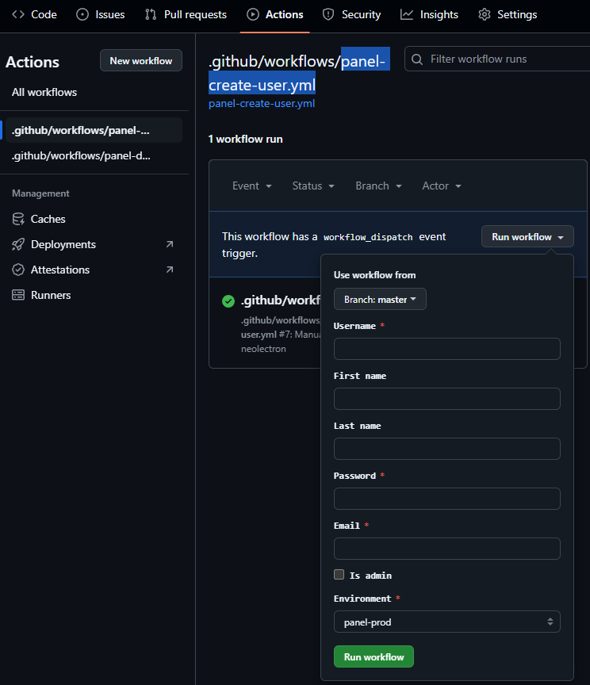

# Codinglab.gg

### Basically codinglab gaming related projects.

**What to find here ?**

- A pterodactyl dashboard panel to manage all game-servers.
- Game servers docker images that we use to play.
- Custom plugins and configurations for games we play.

## How to setup the pterodactyl panel

Fork this repo.
Open your github repo secrets and add the following:

- `CODINGLABGG_SSH_KEY` : The private key to connect to the server
- `CODINGLABGG_SSH_USER` : The user used to connect to the server (`pterodactyl`)
- `CODINGLABGG_SSH_HOST` : The host/ip of the serve that run the panel (`codinglab.gg`)
- `CODINGLABGG_SSH_CERT` : The public certificate of the server (`ssh-keyscan codinglab.gg`)

Make sure your server is setup with docker and docker compose plugin, and your user can run docker commands.

Then push to the repository, [the github `panel-deployment.yml` action](./.github/workflows/panel-deployment.yml) will deploy the panel to the server.

Now you should be able to access the panel at your desired domain, under https.

You still have to create your first user (admin) tho.
To do so, go into your github repo > actions > panel-create-user.yml > run workflow > and fill this form :

## How to setup a fresh game server

First you need to create a Location, then a Node in the panel.

Click on `Nodes` > `Create New` > Fill the form with the server's informations.

Then you need to copy the Node Configuration `config.yml` from the panel.

To setup a fresh game server, you need to run the wings agent on the server.
The wings agent is the software that connects the game server to the panel.
